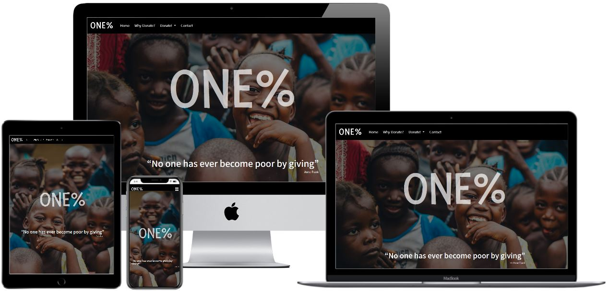

<h1 align="center">Milestone Project 1 - ONE%</h1>

[ :link: Click here to view the live project :link:](https://matsim91.github.io/Milestone-Project-1-One-Porcent)

One% is a charity project. The first main purpose is to make people aware that everyone can donate a really small portion of their income (like one%) and this would still make a great difference in the lives of many childrens and adults in poor condition. The second main purpose is to re-direct potential donors to three non-profit organization where they can donate directly to these organizations.

### Table Of Contents

1. [User Experience (UX)](#user-experience)
    - [User stories](#user-stories)
    - [Design](#design)
    - [Wireframes](#wireframes)
2. [Features](#features)
3. [Technologies Used](#technologies-used)
4.  [Languages Used](#languages-used)
5.  [Frameworks, Libraries & Programs Used](#frameworks-libraries-and-programs-used)
6.  [Testing](#testing)
    - [Testing User Stories](#testing-user-stories)
    - [Further Testing](#further-testing)
    - [Known Bugs](#known-bugs)
7. [Deployment](#deployment)
8. [Credits](#credits)
    - [Code](#code)
    - [Content](#content)
    - [Media](#media)
    - [Acknowledgements](#acknowledgements)

## User Experience

-   ### User stories

    -   #### First Time Visitor Goals
	1. Quickly understand the main objective of the website and what it offers.
	2. Navigate naturally and easily through the website different sections (using the navbar to go to a specific page or using the arrow on the bottom of the page to go through a continuous flow) even if the user is not computer-savy.
	3. Get interested about charity and look for further information within the website.

    -   #### Returning Visitor Goals
	1. Be familiarized with website interface and how the website flow works.
	2. Motivate returning visitor to donate again.
    3. As a returning user he can use the navbar to go to the specific page he is looking for.

    -   #### Frequent User Goals
    1. Navigate the website looking for news updates regarding the different non-profit organizations working in Africa.
    2. Motivate frequent user to continue donating.
    3. Present new content to motivate frequent user to come back.

-   ### Design
    -   #### Colour Scheme
	- The four main colors used are blue, green, black and white. I choose the colors pallete that are more alive and better represent happiness and childhood for the body. For the navbar and footer I choose a more neutral color for balance.

        

    -   #### Typography
	- For the logo, I choose a more happy font to better show the purpose of the website (by donating and bringing happiness to kids). The font used for the logo was the "Fresca" font designed by Fontstage.

    -   #### Imagery
	- The hero image was carefully choosen to give life to the website and really stand out on the homepage. It was intended to show the happiness and hope that these kids have even living in poor conditions. Happiness is simple, happiness is being grateful for what we have, this is the intent of the images spread across this website and also the intent of the content.
    - The remaining images were all choosen for the vivid contrast they have and to also show gratitude and happeniness.
*   ### Wireframes

    - Home Page Wireframe - [View](https://github.com/MatSim91/Milestone-Project-1-One-Porcent/blob/master/assets/wireframes/home.jpg)

    - Why Donate? Page Wireframe - [View](https://github.com/MatSim91/Milestone-Project-1-One-Porcent/blob/master/assets/wireframes/why-donate.jpg)

    - Donate! Page Wireframe - [View](https://github.com/MatSim91/Milestone-Project-1-One-Porcent/blob/master/assets/wireframes/donate.jpg)

    - Contact Page Wireframe - [View](https://github.com/MatSim91/Milestone-Project-1-One-Porcent/blob/master/assets/wireframes/contact.jpg)

## Features

- Burger nav bar

- Drop down menu using bootstrap library and Popper.js library

- Responsive on all device sizes

- Interactive elements

- Hover.css

- Interactive Flip Cards

## Technologies Used

Brief overview of the languages, frameworks, and other tools I've used on this project:

- [HTML5](https://en.wikipedia.org/wiki/HTML5)
    - Semantic markup language as the shell of the site.

- [CSS3](https://en.wikipedia.org/wiki/Cascading_Style_Sheets)
    - Cascading Style Sheets as the design of the site.

- [CSS Grid](https://en.wikipedia.org/wiki/CSS_grid_layout)
    - Grid allows for a responsive layout across various platforms.

- [JavaScript](https://www.javascript.com)
   - Used for open/close effect on mobile navbar, as well as the fancybox implementation.

- [Font Awesome 5](https://fontawesome.com)
   - Use of social media icons.

## Languages Used

-   [HTML5](https://en.wikipedia.org/wiki/HTML5)
-   [CSS3](https://en.wikipedia.org/wiki/Cascading_Style_Sheets)

## Frameworks, Libraries and Programs Used

1. [Bootstrap 4.4.1:](https://getbootstrap.com/docs/4.4/getting-started/introduction/)
    - Bootstrap was used to assist with the responsiveness and styling of the website.
2. [Hover.css:](https://ianlunn.github.io/Hover/)
    - Hover.css was used on the Social Media icons in the footer to add the float transition while being hovered over.
3. [Google Fonts:](https://fonts.google.com/)
    - Google fonts were used to import the 'Titillium Web' font into the style.css file which is used on all pages throughout the project.
4. [Font Awesome:](https://fontawesome.com/)
    - Font Awesome was used on all pages throughout the website to add icons for aesthetic and UX purposes.
5. [jQuery:](https://jquery.com/)
    - jQuery came with Bootstrap to make the navbar responsive but was also used for the smooth scroll function in JavaScript.
6. [Git](https://git-scm.com/)
    - Git was used for version control by utilizing the Gitpod terminal to commit to Git and Push to GitHub.
7. [GitHub:](https://github.com/)
    - GitHub is used to store the projects code after being pushed from Git.
8. [Balsamiq:](https://balsamiq.com/)
    - Balsamiq was used to create the [wireframes](https://github.com/) during the design process.
9. [Popper.js:](https://popper.js.org/)
    - Popper was used to create the Dropdown menu in the navbar.

## Testing

The W3C Markup Validator and W3C CSS Validator Services were used to validate every page of the project to ensure there were no syntax errors in the project.

-   [W3C Markup Validator](https://jigsaw.w3.org/css-validator/#validate_by_input) - [Results]
-   [W3C CSS Validator](https://jigsaw.w3.org/css-validator/#validate_by_input) - [Results]

### Testing User Stories

-   #### First Time Visitor Goals

-   #### Returning Visitor Goals

-   #### Frequent User Goals

### Further Testing

### Known Bugs

## Deployment

### GitHub Pages

### Forking the GitHub Repository

## Credits

- Font border for the H1 heading (https://stackoverflow.com/questions/2570972/css-font-border)

- Hover.css for interactive effects (https://ianlunn.github.io/Hover/)

- Flip cards (https://www.w3schools.com/howto/tryit.asp?filename=tryhow_css_flip_card)

### Code

-   The full-screen hero image code came from https://unsplash.com/

-   [Bootstrap4](https://getbootstrap.com/docs/4.4/getting-started/introduction/): Bootstrap Library used throughout the project mainly to make site responsive using the Bootstrap Grid System.

-   Color Scheme was choosen from https://coolors.co/

### Content

### Media

-   Images were taken from free images source websites https://unsplash.com/ and https://pixabay.com

### Acknowledgements

-   My mentor Akshat for all his help and ideas.

-   Slack channel peer-code-review for feedback.